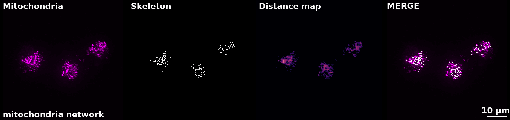
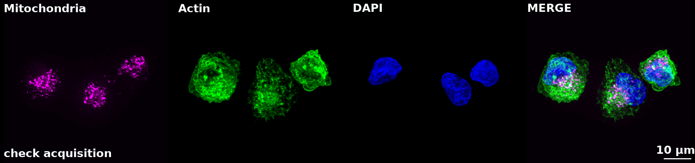
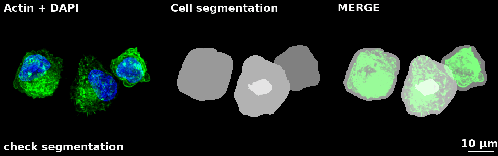
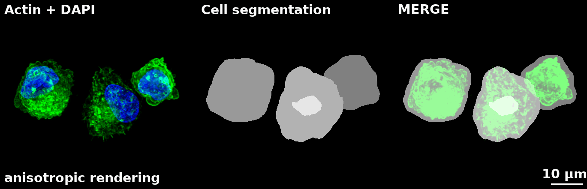
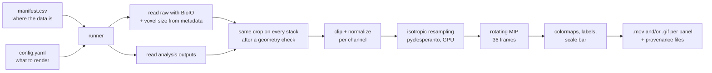

# 🐉 CHIMERA

**3D-rendered movies of raw microscopy data and analysis results, side by side**


<p align="center">
  
</p>
<p align="center"><sub>Mitochondrial network of single cells: raw signal, 3D skeleton, distance map, and merge of raw signal and skeletons. Same crop, same rotation.</sub></p>


---

## Why I built this

Cells are three-dimensional, yet a lot of image analysis still treats them as flat.

I'm an imaging technologist at the Imaging Unit of IEO, and most of my work is writing analysis pipelines for 3D fluorescence microscopy: segmentation, skeletonization, quantification of complex networks inside the cell. I'm a bit obsessed with doing all of it in 3D, for a simple reason. Flattening a cell into a 2D image hides part of its structure, and that can make real biological differences disappear or, worse, produce measurements you can't trust. For a scrupulous scientist, that's not an acceptable trade-off.

Mitochondria are a good example. They form branched networks that wind through the whole cell volume. In a 2D projection, two branches lying at different depths cross and look like a junction that doesn't exist, while a single tubule leaving the focal plane breaks into fragments. Branch length, number of junctions and connectivity only mean something when they're measured on the volume.

Working in 3D fixes the measurement problem but creates a new one: how do you check the result? A 3D segmentation has to capture the whole cell and nucleus, a skeleton has to actually follow the mitochondria or microtubules, and scrolling through Z slices in Fiji is a poor way to judge either. You need to see the raw data and the analysis output together, in 3D, from every angle.

And convincing myself is only half the job. In a core facility, the analysis is done for someone else: the scientists I collaborate with are the ones who will build conclusions, and eventually papers, on those numbers. They need to be convinced too, and the most convenient way for them is a clear, well-made analysis report. So the 3D check has to become something that fits on a slide: a movie they can press play on, where the skeleton rotates on top of the mitochondria and it's clear at a glance that the analysis did what it was supposed to do.

*That's what CHIMERA does.*

**Why not the existing tools?** Doing it by hand in Fiji means aligning crops, matching brightness/contrast across channels, adding scale bars and labels, exporting, and starting over for the next cell. Fine for one figure, an afternoon lost for a whole experiment, and every manual step is a chance to make a mistake. My first attempt at automating it was a Jython script inside Fiji. It worked, but it never generalized: panel layouts were hardcoded, and crops had to be drawn by hand on every image because reading coordinates from a CSV in Jython was too clumsy to be practical. napari [[1]](#references) renders 3D beautifully, but you can't put an interactive viewer into a PowerPoint report or a paper figure.

**CHIMERA turns all of this into a batch job.** Describe the panels once in a YAML file, list your crops in a CSV, and get one movie per crop per panel, with scale bar and labels, on a laptop or as a SLURM job on the cluster. Watching a 3D skeleton rotate on top of the network it was extracted from is the fastest way I know to convince someone, myself included, that the analysis, and therefore the numbers, can be trusted.

The name *'CHIMERA'* comes from what each panel is: a small chimera made of the original acquisition and the output of the analysis, stitched into a single movie.

**Not just mitochondria.** The example here comes from a mitochondrial network analysis (spinning disk, deconvolved stacks: mitochondria, phalloidin, DAPI), but nothing in the code is tied to it. Change the YAML, and CHIMERA renders whatever masks and analysis outputs your workflow produces. Examples from a 3D microtubule analysis, published in [[2]](#references), are coming soon.

## What it produces

Every panel below is defined entirely in [`src/configs/default_config.yaml`](src/configs/default_config.yaml). Adding a new one is a YAML block, not a new Python function.

**`check_acquisition`**: each channel on its own, then the merge. This is the sanity check I look at first. Brightness and contrast are set once in the config and applied to every image, so they are comparable to each other.



**`segmentation`**: actin + nuclei next to the cell segmentation, and the overlay.



**`mito_skeleton`**: the mitochondrial signal, its 3D skeleton, the distance map (ImageJ "Inferno"-style LUT) and the raw signal with the skeleton on top.


<details>
<summary>Why isotropic resampling matters</summary>



Here is the result of rendering voxels as acquired (Z step 0.2 µm, XY pixel 0.065 µm), the cell looks squashed when rotated
</details>

## How it works



The split between the two input files is deliberate. The **config** holds everything that affects how the image looks (channel roles, colors, clip ranges, panel layout) and stays the same for the whole experiment. The **manifest** holds everything that changes from image to image (file paths, series index, crop coordinates). A new batch of cells means a new CSV; the visual choices don't move.

## Quick start

```bash
git clone https://github.com/ambeeblush/CHIMERA.git
cd CHIMERA
conda create -n chimera python=3.11
conda activate chimera
pip install -e .
```

`pyclesperanto_prototype` [[3]](#references) needs a working OpenCL device. Without a GPU it still runs, and if the device doesn't support linear interpolation it falls back to SciPy.

**1. Describe your channels and panels** in a YAML file. A trimmed example:

```yaml
config_version: 1

acquisition:
  channels:       {mito: 0, ph: 1, dapi: 2}
  channel_labels: {mito: Mitochondria, ph: Actin, dapi: DAPI}
  colormaps:      {mito: magenta, ph: green, dapi: blue}
  clip:
    mito: [100, 1000]
    ph:   [500, 10000]
    dapi: [300, 3500]

mito_output:
  channels:       {cyto: 0, skels: 1, distance: 2}
  channel_labels: {cyto: Cells, skels: Mito Skels, distance: Mito Distances}
  colormaps:      {cyto: grays, skels: grays, distance: inferno}
  clip:
    cyto: [0, 20]
    skels: [0, 1]
    distance: [0, 12]

panels:
  mito_skeleton:
    tiles:
      - title: Mitochondria
        channels: [{section: acquisition, role: mito}]
      - title: Skeleton
        channels: [{section: mito_output, role: skels}]
    gutter_px: 8
    scalebar_on: last
    filename_on: first
```

Not sure what clip values to use? `chimerat.clipping.suggest_clip()` prints a ready-to-paste `clip:` block from the percentiles of a real image.

**2. List your crops** in a CSV. One row = one crop. Empty crop cells mean "full extent".

```csv
crop_id,raw_img_path,mito_output,series_index,z0,z1,y0,y1,x0,x1,panels,notes
cellA,raw/Image1.tif,elab/Image1_elab.tif,1,,,29,371,608,950,,
cellB,raw/Image2.tif,elab/Image2_elab.tif,1,,,418,859,536,977,mito_skeleton,only the skeleton here
```

**3. Check, then run:**

```bash
# what would be produced, without rendering anything
chimera --config configs/my_config.yaml --manifest crops.csv --output-dir out --dry-run

# render
chimera --config configs/my_config.yaml --manifest crops.csv --output-dir out \
        --n-frames 36 --fps 6 --scalebar-um 10 --quality 8
```

**On a SLURM cluster**, `examples/slurm/submit_panels.sh` runs the same command as a job array. Each task picks its share of the manifest automatically from `SLURM_ARRAY_TASK_ID` / `SLURM_ARRAY_TASK_COUNT`, so there's nothing to pass by hand.


## Design decisions I'd defend in a code review

A few choices that aren't obvious from the outside, and the reason behind each.

**No hidden defaults for anything that changes the picture.** Channel indices, clip ranges and colormaps must be written in the YAML. If a channel shouldn't be clipped, you write `null` explicitly. When a figure ends up in a paper, the config file is the record of how it was made, and a default buried in a function signature isn't part of that record.

**Unknown keys are an error, not a warning.** Writing `colormap:` instead of `colormaps:` stops the run and suggests the right name (`difflib`). Otherwise the typo would be silently ignored and you'd get a gray image with no clue why.

**One clip range, two jobs.** The same `[lo, hi]` pair is used both to clip and to map intensities to 8 bit, like Brightness/Contrast in ImageJ. Normalizing to each image's own min/max after clipping would give different mappings to different cells of the same experiment, and side-by-side comparisons would be misleading.

**Geometry is checked before cropping.** Raw data and analysis outputs get the same crop coordinates, so they must share the same reference frame. If an analysis output was produced on an already-cropped field, the shapes won't match and the run fails, instead of producing a plausible-looking but misaligned figure.

**Voxel size comes from the file, per scene.** Spacing is read from the metadata with BioIO *after* selecting the series, since scenes in a multi-series file can have different calibrations.

**Built for batch, not only for notebooks.** Exit codes distinguish "all good" (0), "some rows failed" (1) and "bad configuration" (2), so SLURM doesn't mark a run as COMPLETED when no movie came out. Work is split round-robin across array tasks rather than in contiguous blocks, because crops can differ a lot in size and one task shouldn't get all the big ones. Every run saves `config_used.yaml`, `manifest_used.csv` and a JSON summary per shard.

## Repository layout

```
CHIMERA/
├── src/
│   ├── chimerat/
│   │   ├── cli.py            # command line, sharding, exit codes
│   │   ├── config.py         # YAML loading and validation
│   │   ├── manifest.py       # CSV loading and validation
│   │   ├── runner.py         # reads the data, runs each manifest row
│   │   ├── panels.py         # isotropic resampling, rotating MIP, tiles, .mov/.gif export
│   │   ├── clipping.py       # clip + normalization, suggest_clip()
│   │   ├── colormaps.py      # ImageJ colormaps and LUTs (single source of truth)
│   │   └── scalebar.py       # scale bar and channel labels
│   └── configs/
│       └── default_config.yaml
├── input_csv/
│   └── csv_example.csv   # example manifest
├── examples/
│   └── slurm/
│       └── submit_panels.sh  # SLURM job array template
├── docs/media/               # GIFs used in this README
├── LICENSE
├── README.md
└── pyproject.toml
```

Stack: NumPy, SciPy, scikit-image, BioIO, pyclesperanto, imageio (H.264 via ffmpeg), Pillow, matplotlib, PyYAML.

## Limitations and what's next

No tool is perfect, and this one is no exception. Here's what's missing and what's coming next.

- Rendering is maximum intensity projection, not volume rendering. It's the standard choice in microscopy and it's fast, but there's no depth shading or transparency.
- Isotropic resampling assumes square pixels in XY (`spacing_y == spacing_x`) and raises an error otherwise.
- Output is `.mov` and `.gif` only for now. I chose these formats because they work in PowerPoint.
- [ ] Include `.mp4` format for output
- [ ] Speed up rendering: the per-frame rotation still runs on the CPU with SciPy, while resampling is already on the GPU
- [ ] Unit tests for `config` and `manifest` (the parts where a silent bug would hurt most)
- [ ] Example dataset small enough to ship with the repo, so the Quick start runs end to end
- [ ] Integration directly into napari to choose crop coordinates and have a preview before rendering

## Related work

The analysis outputs shown here (cell segmentation, mitochondrial skeletons, distance maps) come from a separate 3D analysis pipeline, which I can't publish yet because the paper is still in preparation. It will be released here once the paper is out.

## About me

I'm Ambra Dondi, a **microscopist** and **bioimage analyst** at the Imaging Unit of IEO (European Institute of Oncology) in Milan. I'm a biologist by training, with a PhD in Molecular Oncology. Day to day, I build Python pipelines for 3D fluorescence microscopy analysis, to extract numbers, and therefore insights, from images. I also teach image analysis to PhD students of SEMM (European School of Molecular Medicine) and to master's students.

I'm interested in roles where I can bring my image analysis skills to other domains: at the end of the day, images are images, whether they come from a microscope, a satellite, a whole-slide scanner in a pathology lab or a camera on a production line. The problems are surprisingly similar: noisy signal, objects to segment, measurements that have to be reliable, and results that people need to be able to trust. That last part, showing the result on top of the raw data, is exactly what this repo is about.

[LinkedIn](https://www.linkedin.com/in/ambra-dondi) · [ORCID](https://orcid.org/0000-0001-7594-2105) · [Email](mailto:ambra.dondi@hotmail.com)

## Publications with my analyses

Most of the pipelines I've built aren't public yet. In academic research, analysis code usually goes out together with or after the paper it was written for, and several of the projects I've worked on are still unpublished. CHIMERA is the first project I'm releasing, and the others will follow as their papers come out.

In the meantime, these are published papers that include my image analysis workflows:

- Chiesa A., Poli V., [...], **Dondi A.**, [...], Campaner S. (2026). *Functional genomic screens uncover FERMT2 as a critical regulator of YAP/TAZ-driven tumorigenicity.* Cell Death & Differentiation 33(9):1907–1922. [doi:10.1038/s41418-026-01694-w](https://doi.org/10.1038/s41418-026-01694-w)
- Massari L.F., Finardi A., Visintin C., Calabrese E., **Dondi A.**, Visintin R. (2026). *Safeguarding genome integrity: Polo-like kinase Cdc5 and phosphatase Cdc14 orchestrate Topoisomerase II-mediated catenane resolution in mitosis.* Nucleic Acids Research 54(2):gkaf1509. [doi:10.1093/nar/gkaf1509](https://doi.org/10.1093/nar/gkaf1509)
  <br>Quantification of Top2 abundance and distribution in expanded nuclear regions (Fig. 6F–G).
- Eli S., Rauso G., [...], **Dondi A.**, [...], Mapelli M. (2025). *Localized Wnt-signaling promotes asymmetric NuMA-dependent oriented divisions and unequal apportioning of mitochondria.* Nature Communications 16:10690. [doi:10.1038/s41467-025-65775-z](https://doi.org/10.1038/s41467-025-65775-z)
  <br>3D analysis of mitochondrial enrichment as a function of the position of Wnt-coated beads. The pipeline (**POLARIS**) is the next one I'm releasing - *stay tuned!*
- Mulè P., Fernandez-Perez D., [...], **Dondi A.**, [...], Pasini D. (2024). *WNT oncogenic transcription requires MYC suppression of lysosomal activity and EPCAM stabilization in gastric tumors.* Gastroenterology 167(5):903–918. [doi:10.1053/j.gastro.2024.06.029](https://doi.org/10.1053/j.gastro.2024.06.029)


## References

1. napari contributors (2019). *napari: a multi-dimensional image viewer for Python.* Zenodo. [doi:10.5281/zenodo.3555620](https://doi.org/10.5281/zenodo.3555620)
2. Achutti Duso B., Messuti E., [...], **Dondi A.**, [...], Mazzarella L. (2023). *NF1 modulates microtubule repair and sensitivity to antibody-drug conjugates.* bioRxiv 2023.12.06.569572. [doi:10.1101/2023.12.06.569572](https://doi.org/10.1101/2023.12.06.569572)
3. https://github.com/clEsperanto/pyclesperanto_prototype


## License

MIT, see [LICENSE](LICENSE).
